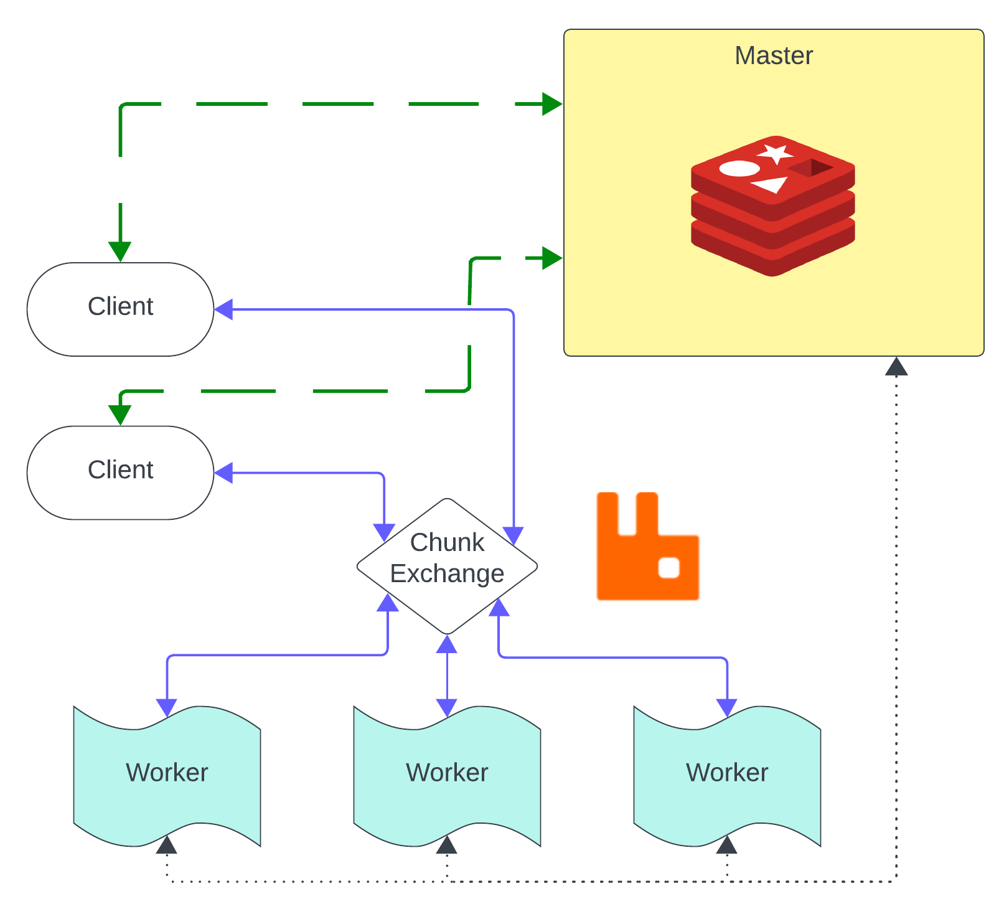
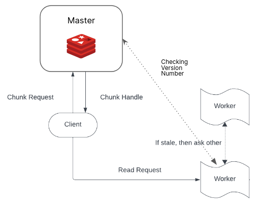
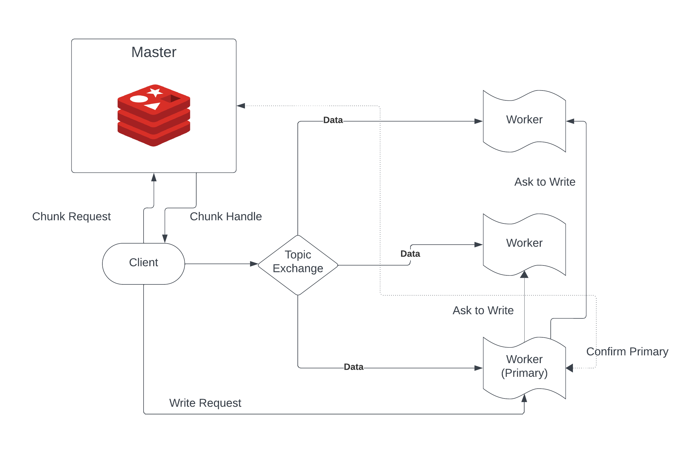

# GFS-with-Redis
**Authors:** Divyansh Mittal (2020CS10342), Nischay Diwan (2020CS50433)  


## Reproduce the results
### 1. Install Redis
```
snap install redis
sudo apt install redis-server
```

### 2. Install docker
Refer https://docs.docker.com/engine/install/ubuntu/ for the installation instructions

### 3. Install python packages
```
pip3 install -r requirements.txt
```

### 4. Run the bakcend
```
make backend
```

### 5. Run the code
To run the unit tests, simply do 
```
make unittest
```

To run the analysis tests, use 
```
python3 -m Analysis_tests.test_name
```
where `test_name` is the name of the test


## Abstract
Here we have re-implemented the Google File System in Python from scratch using Redis and RabbitMQ. Our system is fault-tolerant, testing for packet drops and chunk-servers dying. We assume that the master does not go down. This document presents our design, discusses the implementation, and provides some statistics.

## Design Overview

### Interface
We implement the read and write interface. The write interface requires the user to specify the name of the file, the offset, and the data. If the offset is not the last chunk, we return a BAD_OFFSET error code, along with information about the offset of the last chunk. If the file is not present, we create a new file. Read semantics are similar, where the user provides the filename and the offset.

Our write semantics allow multiple writers to concurrently append data to the file while guaranteeing the atomicity of each client's individual writes.

### Architecture
Our implementation contains a Single Master(Server), Multiple Clients, and Multiple ChunkServers(Workers).



#### Master(Server)
- Maintains the bookkeeping of files, chunk handles, and their locations.
- Manages the lease allotment to each primary.
- Launches three threads handling chunk requests, lease management, and handling chunk-server crashes.

#### ChunkServer(Worker)
- Each chunk-server stores chunks of files as storage.
- Implements replication with a single primary chunk-server containing the latest version of chunks.
- Launches three threads for heartbeat exchange, chunk-server runtime, and chunk request handlers.

#### Client
- Communicates with master and chunk-servers to perform reads and writes.
- Exposes read and write operations as APIs.

#### Chunks and ChunkHandles
- Chunks and their associated chunk handles are implemented as classes with attributes like list of chunkservers, version number, primary, lease time, and a unique UUID.

#### Redis
- Used as part of the master for persistent storage functionality.
- Stores lease time, version number, and primary information for each chunk.

#### Rabbit-MQ
- Essential for data plane communication, facilitating the transfer of data and requests across the network.

## Implementation

### Request Queues
We use Rabbit-MQ to create request queues in both master and chunk-servers, and requests are handled in the order of receiving through the chunk exchange thread.

### Heartbeat
Each chunk-server periodically updates its liveness counter to the master through Redis. The master keeps track of live chunk-servers using the same Redis channel.

### Getting Chunk Handle
The client queries the master for the chunk handle by passing the file and offset. The master answers this query by checking the existence of the corresponding key. If it doesn't exist, a new chunk handle is created and sent back. If an invalid offset is encountered, the error status of BadOffset is raised.

### Read
The client sends the read request to the chunk-server containing the chunk handle. If the client doesn't have the chunk handle, it queries it from the master. The chunk-server verifies the version number and updates itself if the version is stale.


### Write
The client sends the write request to the primary chunk-server containing the chunk handle. If the client doesn't have the chunk handle, it queries it from the master. The primary forwards the request to other chunkservers and waits for their acknowledgement.


### Lease Management
The master has a lease management thread that iterates over all the chunk handles and updates the lease time of the handle with the least value if it is still alive. If the chunk server is not alive, the lease manager thread sleeps for half the time difference in lease time left. It then checks again if the chunk server is alive now, and so on. This ensures that if the chunk worker comes back up before the lease of this chunk has expired, we always update the lease time and don't unnecessarily update the version number.

### Version Control
One of the server threads performs the job of version controlling. For each chunk handle, it checks if the current time is beyond the time of expiry. If this happens, it knows that the lease has expired, and a new lease and an updated version number are needed. It gets all the chunk workers with the current version number of the chunk and sends a request to update the latest chunk number to the new chunk number.

### Features

#### Design Features
- If a request to a stale chunk-server is made, the chunk-server asks other chunk-servers for this data, updates itself, and returns to the user.
- We never unnecessarily update the version number of any chunk. If one second before the lease time ends, the worker comes back up, our code will always update the lease time. We use an exponential backoff approach similar to TCP protocols.

#### Code Features
- Docker deployment: The code can be deployed using a Docker image with a simple 'make backend' command.
- Unit tests: Each feature has a corresponding unit test to ensure quick development and code stability.
- Redis wrapper: All Redis calls have a wrapper, making it easy to swap out Redis with another storage solution.
- Configurability: All system parameters are easily configurable.

## Testing and Analysis

### Unit Tests
- Chunk Distribution
- Chunk Handle Exchange
- Chunk UUID
- Heartbeat
- Chunk Creation
- Read
- Write

### Analysis Tests
- Scalability Single Client
- Scalability Multiple Client
- Packet Drops
- Worker Fault Tolerance

## Drawbacks
- Too many threads
- Access control information not stored
- LRU Cache not implemented
- No Garbage Collection
- Checkpointing not implemented yet

## Future Work
- Master Fault Tolerance
- Chunk Overwrites
- Using Redis with Raft or replacing Redis with another persistent counterpart.


